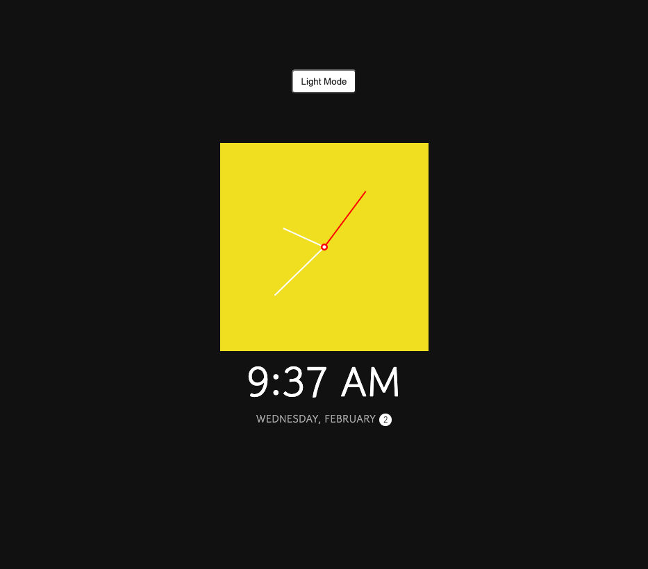
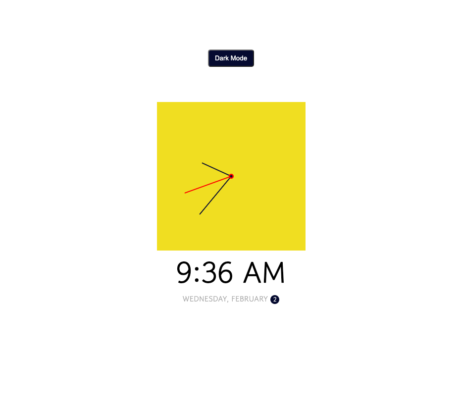

# js-clock

## **Description**

Vanilla JS Clock with current date & time
toggle button for Light or Dark Mode

This was a great way to learn how to map over a range of numbers to return hour, minutes & seconds.
 Find info here for scale: https://stackoverflow.com/questions/10756313/javascript-jquery-map-a-range-of-numbers-to-another-range-of-numbers

## **Table of Contents**
* [Installation](#installation)
* [Usage](#usage)
* [Licenses](#licenses)
* [Badges](#Badges)
* [Questions](#questions)

### **Installation**
none

### **Usage**

Traversy tutorial

### **Technologies Used:**

JavaScript
HTML
CSS

### *Licenses*
MIT license

### *Badges*

### *Questions*
If you have any questions, reach out to me on Git Hub https://github.com/JJLindsey, or send me a message jlindsey010@gmail.com.

©Jennifer Lindsey 2021